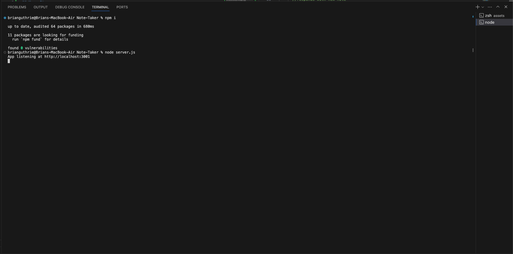

# Note-Taker

## User Story
AS A small business owner
I WANT to be able to write and save notes
SO THAT I can organize my thoughts and keep track of tasks I need to complete

## Acceptance Criteria
GIVEN a note-taking application
WHEN I open the Note Taker
THEN I am presented with a landing page with a link to a notes page
WHEN I click on the link to the notes page
THEN I am presented with a page with existing notes listed in the left-hand column, plus empty fields to enter a new note title and the note’s text in the right-hand column
WHEN I enter a new note title and the note’s text
THEN a "Save Note" button and a "Clear Form" button appear in the navigation at the top of the page
WHEN I click on the Save button
THEN the new note I have entered is saved and appears in the left-hand column with the other existing notes and the buttons in the navigation disappear
WHEN I click on an existing note in the list in the left-hand column
THEN that note appears in the right-hand column and a "New Note" button appears in the navigation
WHEN I click on the "New Note" button in the navigation at the top of the page
THEN I am presented with empty fields to enter a new note title and the note’s text in the right-hand column and the button disappears

## Description
My motivation for this project was to take what I learned from class and apply it in this challenge to make a note taker app. I built this project to show that I have an understanding of creating servers using express.js. Also, creating this app shows my ability to create .get and .post routes to get and update data. I can create a database as well and create those routes to manipulate data in the database to save the users data. This problem solves being able to save user input to a database so that their information is available to them whenever they need.

## Table of Contents
[Go to the Installation section](##Installation)

[Go to the Usage section](##Usage)

[Go to the Tests section](##Technologies)

[Go to the Tests section](##Tests)

[Go to the Questions section](##Questions)

## Installation
Go to https://nodejs.org/en/download and follow the directions on how to download node for your specific operating system.

## Usage
This application is ran by the user going to the initial website link. From there, there is naviagation so that the user can go to the notes page. Also, there is functionality set up to allow the user to put in different path requests to get to different parts of the website.
When the user is on the notes page, they can enter a title for the note and the description and then hit save note, and the note will be saved and display on the page. When they exit the website and then return to it, it still shows their notes due to data persistence by saving the data to the database.

## Technologies
Node.js, npm, javascript, html, css, insomnia, express.js, fs.

## Tests
Run node server.js to run the app and then you can click on the link that the server is running on to open the website in the browser.

## Questions
You can reach me with any questions at my email: brianguthrie88@aol.com.

Or my github: https://github.com/brianguthrie88.